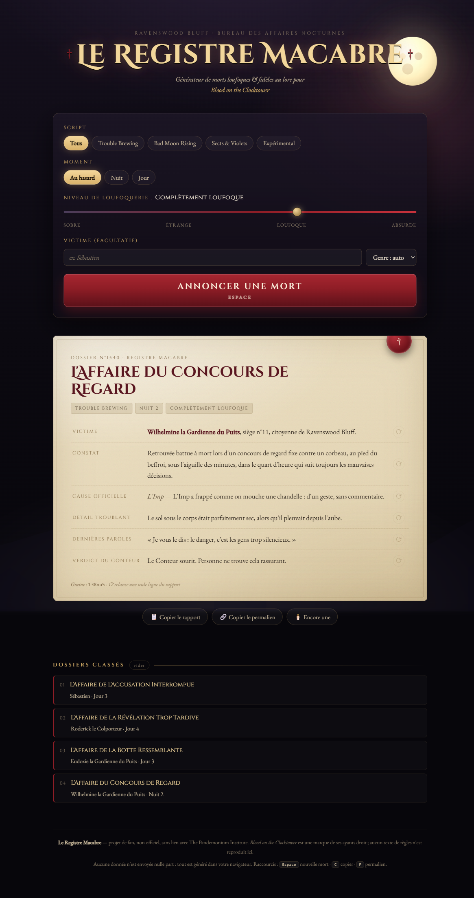

# 🕯️ Le Registre Macabre de Ravenswood Bluff

**Générateur de morts loufoques — et fidèles au lore — pour [Blood on the Clocktower](https://bloodontheclocktower.com/).**

Un Conteur qui annonce « Untel est mort » rate une occasion. Ce générateur produit, en un clic,
un **certificat de décès complet** : la victime, le constat d'une absurdité soignée, la cause
officielle (le bon démon, au bon moment de la nuit), un détail troublant, les dernières paroles
et le verdict du Conteur.

👉 **[Ouvrir le générateur](https://sebplace.github.io/botct-morts-loufoques/)**



---

## Ce qu'il fait

| | |
|---|---|
| 🎭 **37 causes de mort fidèles au lore** | Imp, Zombuul, Pukka, Shabaloth, Po, Fang Gu, Vigormortis, No Dashii, Vortox, Légion, Léviathan, Émeute, Al-Hadikhia, Lil' Monsta, Kazali, Yaggababble, Ojo, Lleech, Seigneur de Typhon… mais aussi l'Assassin, le Parrain, la Sorcière, la Commère, le Tueur, la Vierge, le Bricoleur, le Maladroit, le Chéri, le Barbier, le Psychopathe, le Golem, le rebond du Maire et, bien sûr, le village lui-même. |
| 📜 **4 scripts** | Trouble Brewing, Bad Moon Rising, Sects & Violets, Expérimental — ou tout mélanger. |
| 🌙 **Cohérence jour / nuit** | Une exécution ne se produit jamais la nuit, l'Imp ne frappe jamais en plein débat. Le moment affiché découle de la cause. |
| 🎚️ **Curseur de loufoquerie** | De « gothique sobre » (mort sans une marque, cœur arrêté au carillon) à « absurdité totale » (décès démocratique, mort d'une faute de frappe dans son propre nom). |
| ✍️ **Accord en genre automatique** | « Retrouvé**e** noyé**e** » / « Retrouvé noyé ». Saisissez le prénom d'un joueur réel, le texte s'accorde. |
| ⟳ **Relance ligne par ligne** | Le constat vous plaît mais pas les dernières paroles ? Relancez cette seule ligne. |
| 🔗 **Permalien reproductible** | Chaque rapport a une graine ; l'URL rejoue exactement le même dossier. |
| 🗃️ **Archives locales** | Les 12 derniers dossiers sont conservés dans le navigateur et rejouables d'un clic. |
| 📋 **Copie en texte brut** | Pour coller dans Discord pendant une partie en ligne. |

Plus de **100 000 milliards** de rapports distincts sont possibles.

**Raccourcis clavier :** <kbd>Espace</kbd> nouvelle mort · <kbd>C</kbd> copier · <kbd>P</kbd> permalien.

---

## Un exemple

```
† L'AFFAIRE DU CONCOURS DE REGARD †
Registre macabre de Ravenswood Bluff — dossier n°1540 — Nuit 2 — Trouble Brewing

VICTIME : Wilhelmine la Gardienne du Puits, siège n°11.
CONSTAT : Retrouvée battue à mort lors d'un concours de regard fixe contre un corbeau,
          au pied du beffroi, sous l'aiguille des minutes, dans le quart d'heure qui suit
          toujours les mauvaises décisions.
CAUSE OFFICIELLE : L'Imp — L'Imp a frappé comme on mouche une chandelle : d'un geste,
          sans commentaire.
DÉTAIL TROUBLANT : Le sol sous le corps était parfaitement sec, alors qu'il pleuvait
          depuis l'aube.
DERNIÈRES PAROLES : « Je vous le dis : le danger, c'est les gens trop silencieux. »
VERDICT DU CONTEUR : Le Conteur sourit. Personne ne trouve cela rassurant.
```

---

## Installation

Aucune. C'est une page statique, sans dépendance, sans build, sans réseau.

```bash
git clone https://github.com/sebplace/botct-morts-loufoques.git
cd botct-morts-loufoques
# ouvrez index.html dans un navigateur, ou :
python -m http.server 8000
```

Tout est généré dans le navigateur : **aucune donnée ne sort de votre machine.**

---

## Structure

```
index.html      structure de la page
styles.css      thème gothique (clocher animé, parchemin, sceau de cire)
app.js          moteur : hasard reproductible, accord en genre, rendu, permaliens
data/lore.js    toutes les tables de texte — c'est ici qu'on écrit
```

---

## Écrire vos propres morts

Tout le contenu vit dans [`data/lore.js`](data/lore.js). Une « manière de mourir » est un couple
`[description, titre de l'affaire]` :

```js
["noyé{e} dans un tonneau de soupe à l'oignon encore tiède", "L'Affaire du Tonneau Tiède"]
```

La description se place après « Retrouvé{e} ». Les marqueurs d'accord disponibles :

| Marqueur | Masculin | Féminin |
|---|---|---|
| `{e}` | *(rien)* | `e` |
| `{il}` / `{Il}` | il / Il | elle / Elle |
| `{le}` | le | la |
| `{un}` | un | une |
| `{lui}` | lui | elle |
| `{ce}` | ce | cette |

⚠️ Ces marqueurs s'accordent avec **la victime**. N'en mettez pas sur un mot qui se rapporte à
autre chose (le démon, un objet) : `opérationnel{le}` donnerait « opérationnelle » au masculin.

Pour ajouter une cause, complétez le tableau `CAUSES` :

```js
{
  id: "mon-demon", script: "exp", camp: "demon", quand: "nuit", nom: "le Nom Affiché",
  intro: ["Phrase qui explique la mort, dans le ton du personnage."],
  manieres: [["manière spécifique à ce démon", "Titre de l'affaire"]],
  lieux: [/* optionnel : remplace les lieux génériques */],
  moments: [/* optionnel : remplace les moments génériques */]
}
```

`quand` vaut `"nuit"`, `"jour"` ou `"toujours"` — c'est ce qui garantit la cohérence du cycle.
`script` vaut `"tb"`, `"bmr"`, `"sv"`, `"exp"` ou `"all"` (présent dans tous les scripts).

Les contributions sont les bienvenues, surtout les morts qui font rire à voix haute une table
de quinze personnes à deux heures du matin.

---

## Licence & mentions

Code et textes sous licence [MIT](LICENSE).

Projet de fan, **non officiel**, sans aucun lien avec The Pandemonium Institute.
*Blood on the Clocktower* et les noms de personnages cités sont la propriété de leurs ayants droit ;
aucun texte de règles n'est reproduit ici. Ce générateur ne fait qu'inventer des façons ridicules
de mourir à Ravenswood Bluff.

Bonne nuit, tout le monde. 🕯️
